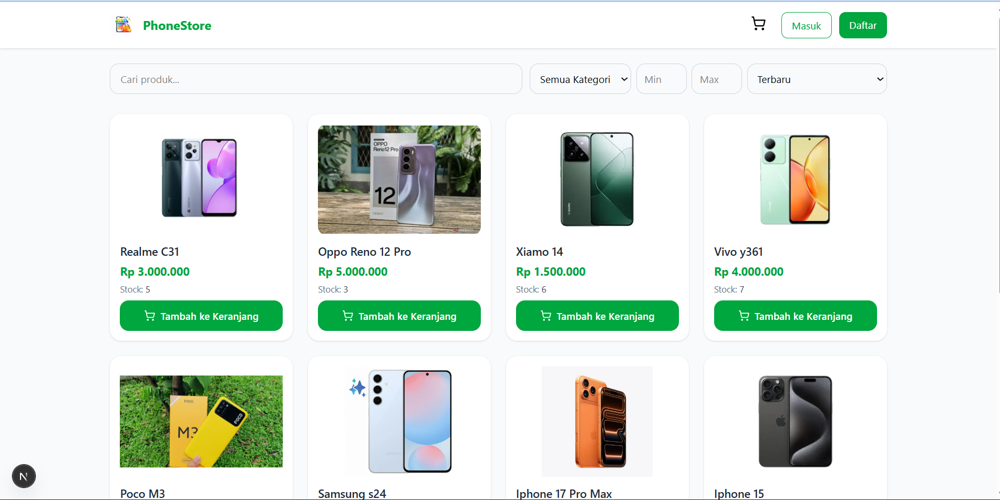
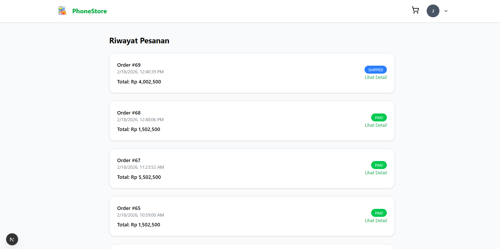
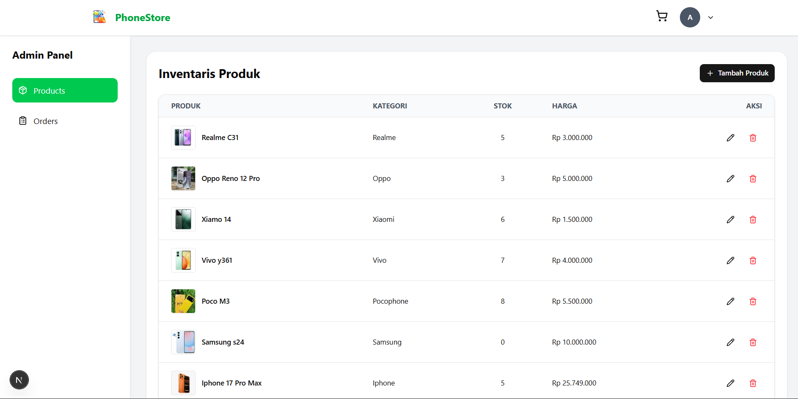

## Phone Store

**Phone Store** adalah aplikasi e-commerce untuk menjual smartphone dengan fitur pembayaran online, manajemen order, dan notifikasi email otomatis. Proyek ini dibangun menggunakan Next.js dan Supabase dengan integrasi Midtrans untuk pembayaran.

## Features List

- Autentikasi pengguna (Login & Register)
- CRUD Produk & Kategori
- Keranjang belanja & Checkout
- Integrasi Midtrans untuk pembayaran online
- Update status order oleh admin (`PAID`, `SHIPPED`, `COMPLETED`)
- Email notifikasi otomatis untuk setiap perubahan status
- Realtime stock update
- Halaman responsive untuk desktop & mobile
- Tampilan order detail dengan daftar produk

## Tech Stack

- **Frontend:** Next.js (App Router, React 18)
- **Backend / API:** Next.js API Routes
- **Database:** Supabase (PostgreSQL)
- **State Management:** Zustand
- **Payment Gateway:** Midtrans
- **Email Service:** Nodemailer
- **UI / Styling:** Tailwind CSS
- **Version Control:** Git & GitHub

## Setup instructions

```bash
npx create-next-app@latest phonestore

cd phonestore

code .

npm install
```

## Getting Started

First, run the development server:

```bash
npm run dev
# or
yarn dev
# or
pnpm dev
# or
bun dev
```

**Live Demo:**

**Page View**




